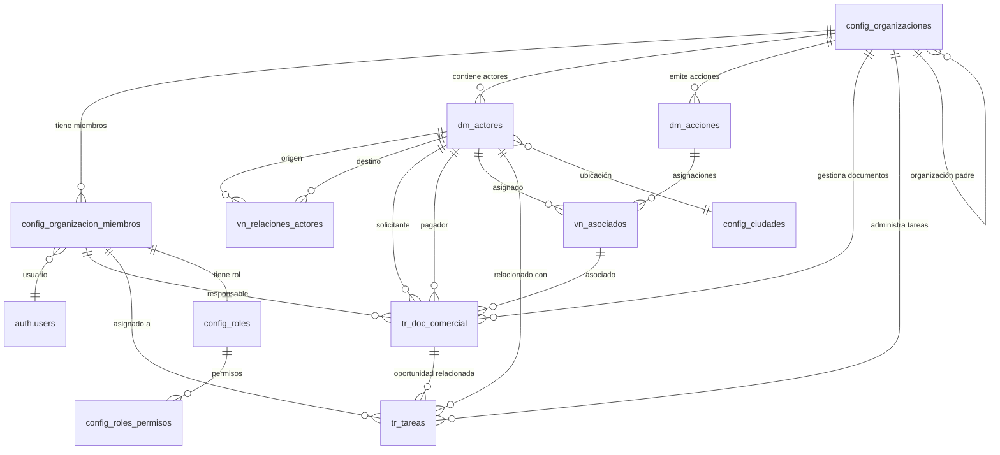

# Base de Datos - SOCIOS_ADMIN

## Documentación Técnica Completa

## 1. Visión General

Sistema de gestión integral para organizaciones tipo club, enfocado en:

- **Gestión de Socios de Negocio (Business Partners)**: Personas y empresas con roles múltiples (socios, clientes, proveedores)
- **Acciones del Club**: Títulos de valor con asignación temporal y jerárquica (dueños, titulares, beneficiarios)
- **Documentación Comercial**: Oportunidades, ofertas, pedidos y reservas con flujo de estados
- **Gestión de Tareas**: Tareas relacionadas con oportunidades y actores

**Características arquitectónicas**:

- Multi-tenancy con organizaciones independientes y jerárquicas
- Class Table Inheritance (CTI) para personas y empresas unificadas
- Soft Delete y Audit Trail completos en todas las tablas
- RBAC granular (owner, admin, analyst, auditor)
- Relaciones temporales con historial de cambios

## 2. Organización del Esquema

### Prefijos de Nomenclatura

El esquema utiliza prefijos para clasificar tablas por su propósito:

| Prefijo | Significado | Acceso | Ejemplos |
|---------|-------------|--------|----------|
| `config_*` | Configuración y control del sistema | Solo owners | organizaciones, roles, permisos |
| `dm_*` | Data Master (entidades de negocio principales) | Todos los roles | actores, acciones |
| `vn_*` | Vistas normalizadas/relacionales (N:M o vistas) | Todos los roles | asociados, relaciones_actores |
| `tr_*` | Tablas transaccionales (documentos y tareas) | Todos los roles | doc_comercial, tareas |

## 3. Diagrama Entidad-Relación (ER)



## 4. Tablas por Dominio

### 4.1 Configuración y Multi-Tenancy

#### config_organizaciones

**Propósito**: Implementa multi-tenancy y jerarquía estructural

**Campos clave**:

| Campo | Tipo | Descripción |
|-------|------|-------------|
| id | uuid (PK) | Identificador único |
| nombre | text | Nombre legal/descriptivo |
| slug | text (único) | Identificador para URLs |
| tipo | enum | club, asociación, federación, fundación, otro |
| organizacion_padre_id | uuid (FK) | Auto-referencia para jerarquía |
| direccion | jsonb | País, ciudad, dirección_linea1, etc. |
| configuración | jsonb | Configuración técnica específica |

**Campos de auditoría**: creado_en, creado_por, actualizado_en, actualizado_por, eliminado_en, eliminado_por

---

#### config_organizacion_miembros

**Propósito**: Miembros de organizaciones con roles RBAC

**PK compuesta**: (user_id, organization_id)

| Campo | Tipo | Descripción |
|-------|------|-------------|
| user_id | uuid (FK) | Referencia a auth.users |
| organization_id | uuid (FK) | Referencia a config_organizaciones |
| role | enum | owner, admin, analyst, auditor |
| nombres | text | Nombres del miembro |
| apellidos | text | Apellidos del miembro |
| telefono | text | Teléfono de contacto |
| cargo | text | Cargo o puesto |
| atributos | jsonb | Preferencias de usuario (theme, etc.) |

**Auditoría completa**: creado_en, creado_por, actualizado_en, actualizado_por, eliminado_en, eliminado_por

---

#### config_roles

**Propósito**: Definición de roles del sistema

**PK**: role (text)

**Registros**: owner, admin, analyst, auditor

---

#### config_roles_permisos

**Propósito**: Permisos granulares RBAC (role, resource, action)

**PK compuesta**: (role, resource, action)

| Campo | Tipo | Descripción |
|-------|------|-------------|
| role | text (FK) | Rol al que aplica el permiso |
| resource | text | Recurso (tabla o entidad) |
| action | text | Acción (create, read, update, delete, etc.) |
| allow | boolean | Si el permiso está concedido |

**Registros**: 92 permisos configurados

**Restricción**: Solo owners acceden a tablas config_*

---

#### config_ciudades

**Propósito**: Catálogo de ubicaciones geográficas

**Registros**: 1367 ciudades

| Campo | Tipo | Descripción |
|-------|------|-------------|
| id | uuid (PK) | Identificador único |
| country_code | text | Código ISO de país |
| country_name | text | Nombre del país |
| state_name | text | Nombre del estado/provincia |
| city_name | text | Nombre de la ciudad |
| city_code | text | Código de ciudad |
| search_text | text | Texto normalizado para búsqueda |

**Índice**: search_text con unaccent para búsqueda acentuada

---

### 4.2 Gestión de Socios de Negocio (Business Partners)

#### dm_actores

**Propósito**: Entidad base CTI para personas y empresas (Class Table Inheritance)

**PK**: id (UUID, autogenerado)

**Código autogenerado**: codigo_bp (ACT-00000001)

**Campos de discriminación**:

| Campo | Tipo | Descripción |
|-------|------|-------------|
| tipo_actor | enum | persona, empresa |
| nat_fiscal | enum | natural, jurídica |

**Campos específicos para personas**:

| Campo | Tipo | Descripción |
|-------|------|-------------|
| primer_nombre | text | Primer nombre |
| segundo_nombre | text | Segundo nombre |
| primer_apellido | text | Primer apellido |
| segundo_apellido | text | Segundo apellido |
| genero_actor | enum | masculino, femenino, otro, no aplica |
| fecha_nacimiento | date | Fecha de nacimiento |
| estado_civil | enum | soltero, casado, union libre, divorciado, viudo |

**Campos específicos para empresas**:

| Campo | Tipo | Descripción |
|-------|------|-------------|
| razon_social | text | Nombre legal |
| nombre_comercial | text | Nombre de marca |
| regimen_tributario | enum | Responsable de IVA, no responsable, régimen simple, gran contribuyente, no sujeta |
| digito_verificacion | smallint | Dígito verificación NIT (Colombia) |

**Campos comunes**:

| Campo | Tipo | Descripción |
|-------|------|-------------|
| tipo_documento | enum | CC, CE, PA, TI, RC, PEP, PPT, NIT |
| num_documento | text | Número de identificación único |
| email_principal | text | Email de acceso y notificaciones |
| email_secundario | text | Email de respaldo |
| telefono_principal | text | Celular o línea principal |
| telefono_secundario | text | Línea alterna |
| direccion_fisica | text | Dirección física |
| ciudad_id | uuid (FK) | Ciudad de ubicación |

**Banderas**:

| Campo | Tipo | Descripción |
|-------|------|-------------|
| es_socio | boolean | Indica si es socio de la organización |
| es_cliente | boolean | Indica si es cliente |
| es_proveedor | boolean | Indica si es proveedor |

**Perfiles JSONB**:

| Campo | Contenido |
|-------|-----------|
| perfil_identidad | Documentos, nacionalidad, fechas de expedición/vencimiento |
| perfil_profesional_corporativo | Actividad económica, formación, ocupación, sector |
| perfil_salud | Seguridad médica, regímenes, condiciones clínicas |
| perfil_contacto | Terceros para emergencia, administración, contabilidad |
| perfil_intereses | Preferencias personales, áreas de interés social/deportivo |
| perfil_preferencias | Configuración personalizada de servicios, tallas, restricciones |
| perfil_redes | Redes sociales, presencia de marca, sitios web |
| perfil_compliance | Riesgos, cumplimiento legal, estructura de propiedad |
| perfil_referencias | Validaciones sociales, personales o comerciales |

**Estado**:

| Campo | Tipo | Descripción |
|-------|------|-------------|
| estado_actor | enum | activo, inactivo, bloqueado |

**Auditoría completa**: creado_en, creado_por, actualizado_en, actualizado_por, eliminado_en, eliminado_por

---

#### vn_relaciones_actores

**Propósito**: Gestiona vínculos entre actores (laborales, familiares, comerciales)

**PK**: id (UUID)

| Campo | Tipo | Descripción |
|-------|------|-------------|
| organizacion_id | uuid (FK) | Organización propietaria |
| bp_origen_id | uuid (FK) | Actor que inicia la relación |
| bp_destino_id | uuid (FK) | Actor que recibe la relación |
| tipo_relacion | enum | familiar, laboral, referencia, membresía, comercial, otra |
| rol_origen | text | Rol específico del origen |
| rol_destino | text | Rol específico del destino |
| atributos | jsonb | Atributos adicionales de la relación |
| fecha_inicio | date | Inicio de vigencia |
| fecha_fin | date | Fin de vigencia (NULL = vigente) |
| es_actual | boolean (GENERATED) | true si fecha_fin IS NULL |
| es_bidireccional | boolean | Si la relación funciona en ambos sentidos |
| notas | text | Notas adicionales |

**Restricciones**:

- No auto-relación (bp_origen_id != bp_destino_id)
- Fechas válidas (fecha_fin >= fecha_inicio OR fecha_fin IS NULL)

**Auditoría completa**

---

### 4.3 Gestión de Acciones del Club

#### dm_acciones

**Propósito**: Acciones del club (títulos de valor), maestra sin dueños directos

**PK**: id (UUID)

| Campo | Tipo | Descripción |
|-------|------|-------------|
| organizacion_id | uuid (FK) | Organización propietaria |
| codigo_accion | text (único) | 4 dígitos únicos (ej: 4398) |
| estado | enum | disponible, asignada, arrendada, bloqueada, inactiva |

**Relación**: Muchos a muchos con dm_actores a través de vn_asociados

**Auditoría completa**

---

#### vn_asociados

**Propósito**: Asignaciones de acciones a socios con historial temporal

**PK**: id (UUID)

| Campo | Tipo | Descripción |
|-------|------|-------------|
| organizacion_id | uuid (FK) | Organización propietaria |
| accion_id | uuid (FK) | Referencia a dm_acciones |
| business_partner_id | uuid (FK) | Referencia a dm_actores |
| tipo_asignacion | text | dueño (00), titular (01), beneficiario (02+) |
| subtipo_beneficiario | text | conyuge, hijo/a, padre, madre, hermano/a, otro |
| subcodigo | text (CHECK) | 2 dígitos: 00, 01, 02+ |
| codigo_completo | text | codigo_accion + subcodigo (ej: 439801) |
| fecha_inicio | date | Inicio de vigencia |
| fecha_fin | date | Fin de vigencia (NULL = vigente) |
| es_vigente | boolean (GENERATED) | true si fecha_fin IS NULL |
| precio_transaccion | numeric | Valor de compra/venta/arriendo |
| notas | text | Notas adicionales |
| atributos | jsonb | Metadatos adicionales |

**Lógica de subcódigos**:

- 00 = dueño (único por acción)
- 01 = titular (único por acción)
- 02+ = beneficiarios (múltiples, secuenciales)

**Auditoría completa**

---

### 4.4 Documentación Comercial

#### tr_doc_comercial

**Propósito**: Oportunidades, ofertas, pedidos y reservas

**PK**: id (UUID)

**Código**: codigo (DOC-00000001, autogenerado)

**Estructura lógica de columnas**:

**1. IDENTIDAD Y CLASIFICACIÓN**:

| Campo | Tipo | Descripción |
|-------|------|-------------|
| id | uuid (PK) | Identificador único |
| codigo | text (único) | DOC-00000001 |
| tipo | enum | oportunidad, oferta, pedido_venta, reserva |
| sub_tipo | enum | sol_ingreso, sol_retiro, oferta_eventos, pedido_eventos |
| estado | enum | Nueva, En Progreso, Ganada, Pérdida, Descartada |
| fecha_doc | date | Fecha del documento |
| fecha_venc_doc | date | Fecha de vencimiento |

**2. ACTORES Y RESPONSABILIDADES**:

| Campo | Tipo | Descripción |
|-------|------|-------------|
| organizacion_id | uuid (FK) | Organización propietaria |
| asociado_id | uuid (FK) | Referencia a vn_asociados |
| solicitante_id | uuid (FK) | Referencia a dm_actores |
| pagador_id | uuid (FK) | Referencia a dm_actores (puede diferir) |
| responsable_id | uuid (FK) | Usuario responsable |

**3. CONTENIDO FINANCIERO**:

| Campo | Tipo | Descripción |
|-------|------|-------------|
| items | jsonb | Ítems del documento |
| moneda_iso | enum | COP, USD, EUR, etc. |
| valor_neto | numeric | Subtotal antes de impuestos/descuentos |
| valor_descuento | numeric | Total descuentos |
| valor_impuestos | numeric | Total impuestos |
| valor_total | numeric | Neto - Descuento + Impuestos (auto) |

**4. CONTEXTO Y EXTENSIONES**:

| Campo | Tipo | Descripción |
|-------|------|-------------|
| documento_origen_id | uuid (FK) | Auto-referencia (doc origen) |
| notas | text | Notas adicionales |
| tags | text[] | Etiquetas |
| atributos | jsonb | Metadatos adicionales |
| monto_estimado | numeric | Monto estimado inicial |

**5. AUDITORÍA Y CONTROL**:

Campos completos de auditoría: creado_en, creado_por, actualizado_en, actualizado_por, eliminado_en, eliminado_por

**Cálculo automático**: valor_total = valor_neto - valor_descuento + valor_impuestos (trigger)

---

### 4.5 Gestión de Tareas

#### tr_tareas

**Propósito**: Tareas del sistema con relación a oportunidades y actores

**PK**: id (UUID)

**Código**: codigo_tarea (TSK-00000001, autogenerado)

| Campo | Tipo | Descripción |
|-------|------|-------------|
| titulo | text | Título de la tarea |
| descripcion | text | Descripción detallada |
| prioridad | enum | Baja, Media, Alta, Urgente |
| estado | enum | Pendiente, En Progreso, Terminada, Pausada, Cancelada |
| fecha_vencimiento | date | Fecha de vencimiento |
| organizacion_id | uuid (FK) | Organización propietaria |
| oportunidad_id | uuid (FK) | Referencia a tr_doc_comercial |
| relacionado_con_bp | uuid (FK) | Referencia a dm_actores |
| asignado_a | uuid (FK) | Usuario asignado |
| tags | text[] | Etiquetas |

**Auditoría completa**

---

## 5. Vistas Disponibles

#### v_actores_org

**Propósito**: Vista unificada de actores con toda la información consolidada en dm_actores

**Nota**: Ya no requiere JOIN con dm_personas ni dm_empresas (refactorización CTI)

---

#### v_doc_comercial_org

**Propósito**: Vista de documentos comerciales con datos de solicitante y pagador

**Origen**: tr_doc_comercial + dm_actores

---

#### v_tareas_org

**Propósito**: Vista de tareas con información de oportunidad y actor relacionado

**Origen**: tr_tareas + dm_actores + tr_doc_comercial

---

## 6. Enums y Tipos Definidos

### Configuración

| Enum | Valores |
|------|---------|
| config_moneda | COP, MXN, ARS, BRL, CLP, PEN, USD, EUR, GBP, CAD, JPY, CHF, AUD, NZD, CNY, INR, KRW, SGD, HKD, SEK, NOK, DKK, PLN, TRY, ZAR, RUB, AED, SAR, ILS, CZK, HUF, RON, BGN, HRK, MYR, THB, IDR, PHP, VND, TWD, ISK |
| config_organizacion_tipo | club, asociación, federación, fundación, otro |

---

### Actores

| Enum | Valores |
|------|---------|
| dm_actor_estado | activo, inactivo, bloqueado |
| dm_actor_estado_civil | soltero, casado, union libre, divorciado, viudo |
| dm_actor_genero | masculino, femenino, otro, no aplica |
| dm_actor_naturaleza_fiscal | natural, jurídica |
| dm_actor_regimen_tributario | responsable de iva, no responsable de iva, regimen simple tributacion, gran contribuyente, no sujeta a impuesto |
| dm_actor_tipo_documento | CC, CE, PA, TI, RC, PEP, PPT, NIT |
| dm_actores_tipo_relacion | familiar, laboral, referencia, membresía, comercial, otra |

---

### Acciones

| Enum | Valores |
|------|---------|
| dm_accion_estado | disponible, asignada, arrendada, bloqueada, inactiva |

---

### Documentos Comerciales

| Enum | Valores |
|------|---------|
| tr_doc_comercial_estados | Nueva, En Progreso, Ganada, Pérdida, Descartada |
| tr_doc_comercial_subtipo | sol_ingreso, sol_retiro, oferta_eventos, pedido_eventos |
| tr_doc_comercial_tipo | oportunidad, oferta, pedido_venta, reserva |

---

### Tareas

| Enum | Valores |
|------|---------|
| tr_tareas_estado | Pendiente, En Progreso, Terminada, Pausada, Cancelada |
| tr_tareas_prioridad | Baja, Media, Alta, Urgente |

---

## 7. Funciones y Procedimientos

### Seguridad y RBAC

| Función | Parámetros | Retorna | Descripción |
|---------|------------|---------|-------------|
| is_org_member | p_org_id uuid, p_user_id uuid | boolean | Verifica si usuario es miembro de la organización |
| is_org_admin_v2 | p_org_id uuid, p_user_id uuid | boolean | Verifica si usuario es admin/owner |
| is_org_owner_v2 | org_id uuid | boolean | Verifica si usuario es owner |
| can_user_v2 | p_resource text, p_action text, p_org uuid | boolean | Verifica permiso específico |
| can_view_org_membership_v2 | p_org uuid | boolean | Verifica si puede ver membresías |
| org_has_other_owner_v2 | p_org_id uuid, p_excluded_user_id uuid | boolean | Verifica si existen otros owners |
| get_user_orgs | - | SETOF uuid | Retorna organizaciones del usuario |

---

### Auditoría (Triggers)

| Función | Tipo | Descripción |
|---------|------|-------------|
| set_actualizado_por_en | Trigger | Actualiza actualizado_en y actualizado_por |
| set_deleted_by_on_soft_delete | Trigger | Setea eliminado_por al marcar eliminado_en |
| assign_owner_on_org_create | Trigger | Asigna rol owner al creador de organización |
| om_prevent_key_change | Trigger | Previene cambios en PK compuesta de miembros |

---

### Negocio

| Función | Parámetros | Retorna | Descripción |
|---------|------------|---------|-------------|
| generar_siguiente_subcodigo | p_accion_id uuid, p_tipo_asignacion text | text | Genera subcódigo (00=dueño, 01=titular, 02+=beneficiario) |
| tr_doc_comercial_calcular_total | Trigger | - | Calcula valor_total automáticamente |

---

### Utilidades

| Función | Parámetros | Retorna | Descripción |
|---------|------------|---------|-------------|
| search_locations | q text, max_results integer | SETOF config_ciudades | Búsqueda de ciudades con unaccent |
| calcular_digito_verificacion_nit | nit text | integer | Dígito verificación NIT Colombia |
| get_user_email | user_id uuid | text | Email del usuario |

---

## 8. Extensiones PostgreSQL

### Instaladas y Activas

| Extensión | Versión | Schema | Propósito |
|-----------|---------|--------|-----------|
| pgcrypto | 1.3 | public | Funciones criptográficas |
| pg_stat_statements | 1.11 | extensions | Estadísticas de ejecución de consultas |
| unaccent | 1.1 | public | Búsqueda sin acentos |
| uuid-ossp | 1.1 | extensions | Generación de UUIDs |
| pg_cron | 1.6.4 | pg_catalog | Programación de tareas |
| pg_graphql | 1.5.11 | graphql | API GraphQL |
| pg_trgm | 1.6 | extensions | Búsqueda de similitud con trigramas |
| supabase_vault | 0.3.1 | vault | Gestión de secretos |
| index_advisor | 0.2.0 | extensions | Asistente de índices |

---

### Disponibles (no instaladas)

| Extensión | Versión | Propósito |
|-----------|---------|-----------|
| postgis | 3.3.7 | Tipos geográficos |
| pgrouting | 3.4.1 | Rutas |
| pg_net | 0.19.5 | HTTP requests |
| vector | 0.8.0 | Embeddings vectoriales |

---

## 9. Relaciones Clave (Foreign Keys)

### Multi-Tenancy

Todas las tablas de negocio → config_organizaciones(organizacion_id):

- dm_actores.organizacion_id
- dm_acciones.organizacion_id
- vn_asociados.organizacion_id
- vn_relaciones_actores.organizacion_id
- tr_doc_comercial.organizacion_id
- tr_tareas.organizacion_id

---

### Auditoría

Todas las tablas → auth.users:

- creado_por → auth.users(id)
- actualizado_por → auth.users(id)
- eliminado_por → auth.users(id)

---

### Negocio Principales

| Origen | Destino | Tipo |
|--------|---------|------|
| vn_asociados.business_partner_id | dm_actores.id | FK |
| vn_asociados.accion_id | dm_acciones.id | FK |
| vn_relaciones_actores.bp_origen_id | dm_actores.id | FK |
| vn_relaciones_actores.bp_destino_id | dm_actores.id | FK |
| tr_doc_comercial.solicitante_id | dm_actores.id | FK |
| tr_doc_comercial.pagador_id | dm_actores.id | FK |
| tr_doc_comercial.asociado_id | vn_asociados.id | FK |
| tr_doc_comercial.documento_origen_id | tr_doc_comercial.id | Auto-referencia |
| tr_tareas.oportunidad_id | tr_doc_comercial.id | FK |
| tr_tareas.relacionado_con_bp | dm_actores.id | FK |

---

### Configuración

| Origen | Destino | Tipo |
|--------|---------|------|
| config_organizacion_miembros.user_id | auth.users.id | FK |
| config_organizacion_miembros.organization_id | config_organizaciones.id | FK |
| config_organizacion_miembros.role | config_roles.role | FK |
| config_roles_permisos.role | config_roles.role | FK |
| dm_actores.ciudad_id | config_ciudades.id | FK |
| config_organizaciones.organizacion_padre_id | config_organizaciones.id | Self-reference |

---

## 10. Patrones de Diseño Implementados

### Soft Delete

**Campos**:

- eliminado_en (timestamptz) - Timestamp de eliminación lógica
- eliminado_por (uuid) - Usuario que eliminó

**Implementación**: Trigger `set_deleted_by_on_soft_delete()`

**Uso**: No eliminar físicamente, marcar como eliminado

**Consultas**: Incluir `WHERE eliminado_en IS NULL`

---

### Audit Trail Completo

**Campos estándar en todas las tablas**:

| Campo | Tipo | Default | Trigger |
|-------|------|---------|---------|
| creado_en | timestamptz | now() | - |
| creado_por | uuid | auth.uid() | - |
| actualizado_en | timestamptz | now() | set_actualizado_por_en() |
| actualizado_por | uuid | auth.uid() | set_actualizado_por_en() |
| eliminado_en | timestamptz | NULL | Manual |
| eliminado_por | uuid | NULL | set_deleted_by_on_soft_delete() |

---

### Multi-Tenancy

**Campo**: organizacion_id (uuid) en todas las tablas de negocio

**Seguridad**: RLS policies filtran por organización del usuario

**Jerarquía**: organizacion_padre_id permite estructuras anidadas

---

### CTI Pattern (Class Table Inheritance)

**Implementación**: dm_actores como tabla base única

**Antes**: dm_personas y dm_empresas separadas

**Ahora**: Campos unificados en dm_actores con discriminación por tipo_actor

**Ventajas**:

- Simplificación de consultas (1 tabla vs 2+)
- Menos JOINs
- Mejor performance
- Migración de datos simplificada

---

### Código Autogenerado

| Tabla | Campo | Formato | Secuencia |
|-------|-------|---------|-----------|
| dm_actores | codigo_bp | ACT-00000001 | seq_dm_actores_codigo |
| dm_acciones | codigo_accion | 0000 (4 dígitos) |
| vn_asociados | subcodigo | 00, 01, 02+ | Lógica de negocio |
| tr_doc_comercial | codigo | DOC-00000001 | seq_tr_doc_comercial_codigo |
| tr_tareas | codigo_tarea | TSK-00000001 | seq_tr_tareas_codigo |

---

## 11. Seguridad y RLS

### Roles del Sistema

| Rol | Acceso Config* | Acceso Negocio | Descripción |
|-----|----------------|----------------|-------------|
| owner | ✅ Full | ✅ Full | Acceso total a todo |
| admin | ❌ | ✅ Full | Acceso completo a tablas de negocio |
| analyst | ❌ | 👁️ Read-only | Solo lectura en tablas de negocio |
| auditor | ❌ | 👁️ Read-only | Solo lectura en tablas de negocio |

*Config = tablas config_*

---

### Políticas por Tabla

Cada tabla tiene políticas RLS que:

1. Verifican membresía a la organización (is_org_member)
2. Filtran por organizacion_id del usuario
3. Respetan soft delete (eliminado_en IS NULL)
4. Aplican restricciones por rol (owner/admin/analyst/auditor)

**Ejemplo de política**:

```sql
-- Solo owners pueden ver configuración
CREATE POLICY "Owners can view config"
ON config_organizaciones FOR SELECT
TO authenticated
USING (
  is_org_owner_v2(id)
);
```

---

### Funciones SECURITY DEFINER

Funciones que cruzan esquemas con SECURITY DEFINER:

- can_user_v2()
- is_org_member()
- is_org_admin_v2()
- search_locations()

---

## 12. Índices de Performance

### Índices Únicos

- Códigos autogenerados (codigo_bp, codigo_accion, codigo, codigo_tarea)
- Slugs de organizaciones
- PKs compuestas (config_organizacion_miembros, config_roles_permisos)

### Índices en FKs

- Todas las FKs principales tienen índices automáticos

### Índices GIN (JSONB)

- Atributos JSONB (atributos, perfil_*, configuración)
- Arrays (tags)

### Índices Especializados

- search_text en config_ciudades (con unaccent)
- Índices compuestos para consultas frecuentes (organizacion_id + eliminado_en)

---

## Documentos Relacionados

- [TABLES.md](TABLES.md) - Documentación detallada por tabla
- [FUNCTIONS.md](FUNCTIONS.md) - Documentación de funciones y procedimientos
- [VIEWS.md](VIEWS.md) - Documentación de vistas
- [ENUMS.md](ENUMS.md) - Documentación de tipos enumerados
- [RLS.md](RLS.md) - Políticas de seguridad y RLS
- [API.md](API.md) - Ejemplos de consultas SQL comunes
