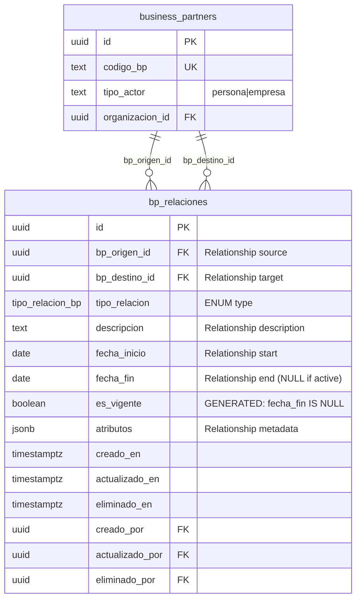
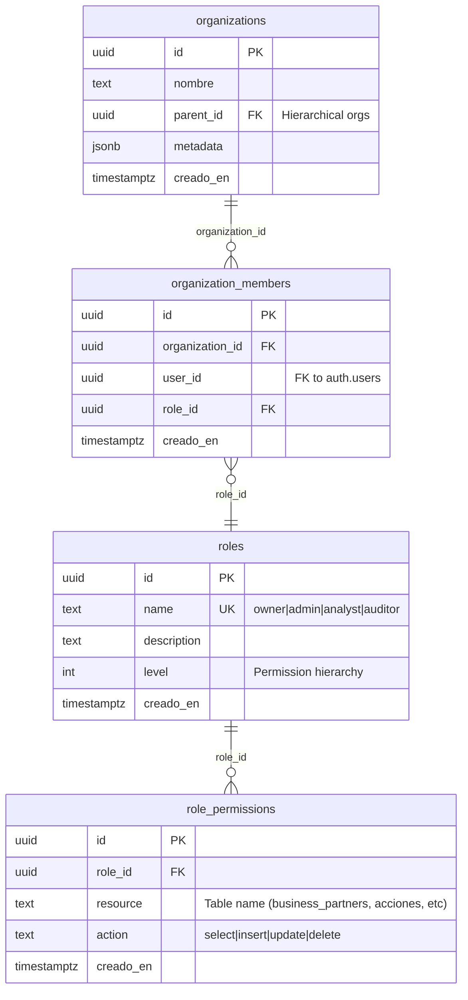

# Database Schema Reference

> **Complete schema documentation with ERD diagrams**
>
> Last updated: 2025-12-28 | Auto-generated from live database schema

---

## Table of Contents

- [Schema Overview](#schema-overview)
- [ERD Diagrams](#erd-diagrams)
  - [1. Complete Database ERD](#1-complete-database-erd)
  - [2. Business Partners Domain](#2-business-partners-domain)
  - [3. Acciones Domain](#3-acciones-domain)
  - [4. Relationships Domain](#4-relationships-domain)
  - [5. Access Control Domain](#5-access-control-domain)
  - [6. Simplified High-Level View](#6-simplified-high-level-view)
- [Tables Summary](#tables-summary)
- [Custom Types](#custom-types)
- [Database Functions](#database-functions)
- [Triggers](#triggers)
- [Views](#views)
- [Indexes](#indexes)
- [Naming Conventions](#naming-conventions)
- [Related Documentation](#related-documentation)

---

## Schema Overview

The database implements a comprehensive business partner management system using PostgreSQL on Supabase. The schema is organized into 4 main domains:

1. **Business Partners** - Organizations, personas (natural persons), empresas (companies)
2. **Acciones** - Club shares with temporal ownership tracking
3. **Relationships** - Connections between business partners
4. **Access Control** - Multi-tenancy, roles, and permissions

### Key Statistics

- **Tables:** 10 (all with RLS enabled)
- **Functions:** 36 total (11 user-facing RPC)
- **Views:** 7 (with SECURITY INVOKER)
- **Triggers:** 5 trigger functions
- **Enums:** 1 custom type (tipo_relacion_bp)
- **Policies:** 38 RLS policies
- **Indexes:** 24 indexes (performance optimization)

### Architecture Patterns

- ✅ **Class Table Inheritance (CTI)** - `business_partners` → `personas` / `empresas`
- ✅ **Multi-Tenancy** - Organization-based data isolation
- ✅ **Soft Delete** - `eliminado_en` timestamp pattern
- ✅ **Temporal Tracking** - Historical data with `fecha_inicio` / `fecha_fin`
- ✅ **Audit Trail** - Automatic tracking of `creado_por`, `actualizado_por`, `eliminado_por`
- ✅ **JSONB Flexibility** - Extensible metadata in `atributos` fields

---

## ERD Diagrams

### 1. Complete Database ERD

**All 10 tables with foreign key relationships**

```mermaid
erDiagram
    organizations ||--o{ business_partners : "organizacion_id"
    organizations ||--o{ organization_members : "organization_id"
    organizations ||--o{ acciones : "organizacion_id"

    business_partners ||--|| personas : "id (1:1)"
    business_partners ||--|| empresas : "id (1:1)"
    business_partners ||--o{ bp_relaciones : "bp_origen_id"
    business_partners ||--o{ bp_relaciones : "bp_destino_id"
    business_partners ||--o{ asignaciones_acciones : "persona_id"
    business_partners ||--o{ empresas : "representante_legal_id"

    acciones ||--o{ asignaciones_acciones : "accion_id"

    organization_members }o--|| roles : "role_id"
    roles ||--o{ role_permissions : "role_id"

    organizations {
        uuid id PK
        text nombre
        uuid parent_id FK
        timestamptz creado_en
    }

    business_partners {
        uuid id PK
        text codigo_bp UK "BP-0000001"
        text tipo_actor "persona|empresa"
        uuid organizacion_id FK
        text email_principal
        text celular_principal
        jsonb atributos
        timestamptz eliminado_en
    }

    personas {
        uuid id PK_FK
        text nombres
        text apellidos
        text tipo_documento
        text numero_documento
        jsonb perfil_persona
    }

    empresas {
        uuid id PK_FK
        text razon_social
        text nombre_comercial
        text nit UK
        text digito_verificacion
        uuid representante_legal_id FK
        jsonb perfil_empresa
    }

    bp_relaciones {
        uuid id PK
        uuid bp_origen_id FK
        uuid bp_destino_id FK
        tipo_relacion_bp tipo_relacion
        text descripcion
        date fecha_inicio
        date fecha_fin
        boolean es_vigente "GENERATED"
        jsonb atributos
        timestamptz eliminado_en
    }

    acciones {
        uuid id PK
        text codigo UK "4398"
        text nombre
        uuid organizacion_id FK
        jsonb metadatos
        timestamptz eliminado_en
    }

    asignaciones_acciones {
        uuid id PK
        uuid accion_id FK
        uuid persona_id FK
        text tipo_asignacion "dueño|titular|beneficiario"
        text subcodigo "00-99"
        text codigo_completo UK "GENERATED 439800"
        date fecha_inicio
        date fecha_fin
        boolean es_vigente "GENERATED"
        jsonb atributos
        timestamptz eliminado_en
    }

    organization_members {
        uuid id PK
        uuid organization_id FK
        uuid user_id
        uuid role_id FK
    }

    roles {
        uuid id PK
        text name UK "owner|admin|analyst|auditor"
        text description
    }

    role_permissions {
        uuid id PK
        uuid role_id FK
        text resource "table_name"
        text action "select|insert|update|delete"
    }
```

---

### 2. Business Partners Domain

**Class Table Inheritance pattern with organizations and specializations**

```mermaid
erDiagram
    organizations ||--o{ business_partners : "organizacion_id"

    business_partners ||--|| personas : "id (PK=PK)"
    business_partners ||--|| empresas : "id (PK=PK)"

    empresas }o--o| business_partners : "representante_legal_id"

    organizations {
        uuid id PK
        text nombre "Organization name"
        uuid parent_id FK "Parent organization"
        jsonb metadata
        timestamptz creado_en
    }

    business_partners {
        uuid id PK
        text codigo_bp UK "Auto-generated BP-0000001"
        text tipo_actor CHK "persona OR empresa"
        uuid organizacion_id FK "Multi-tenancy"
        text email_principal "RFC 5322 format"
        text celular_principal
        jsonb atributos "Custom metadata"
        timestamptz creado_en
        timestamptz actualizado_en
        timestamptz eliminado_en "Soft delete"
        uuid creado_por FK
        uuid actualizado_por FK
        uuid eliminado_por FK
    }

    personas {
        uuid id PK_FK "FK to business_partners.id"
        text nombres "First names"
        text apellidos "Last names"
        text tipo_documento "CC|CE|PA|etc"
        text numero_documento
        date fecha_nacimiento
        jsonb perfil_persona "Demographics, preferences"
        text notas
    }

    empresas {
        uuid id PK_FK "FK to business_partners.id"
        text razon_social "Legal name"
        text nombre_comercial "Trade name"
        text nit UK "9 digits"
        text digito_verificacion "Auto-calculated"
        uuid representante_legal_id FK "FK to business_partners"
        jsonb perfil_empresa "Industry, size, etc"
        text notas
    }
```

**Key Concepts:**

- **CTI Pattern**: Each persona/empresa has exactly one corresponding business_partners record
- **Discriminator**: `tipo_actor` field identifies the specialization ('persona' or 'empresa')
- **Shared Fields**: Common fields (email, phone, organizacion_id) in base table
- **Specialized Fields**: Unique fields (nombres/apellidos for personas, nit/razon_social for empresas)
- **Relationship**: Empresas can reference a business_partner as `representante_legal_id`

---

### 3. Acciones Domain

**Club shares with temporal ownership tracking**

```mermaid
erDiagram
    organizations ||--o{ acciones : "organizacion_id"
    acciones ||--o{ asignaciones_acciones : "accion_id"
    business_partners ||--o{ asignaciones_acciones : "persona_id"

    organizations {
        uuid id PK
        text nombre
    }

    acciones {
        uuid id PK
        text codigo UK "4398 (4-digit)"
        text nombre "Action name/description"
        uuid organizacion_id FK
        text estado "activa|suspendida|cancelada"
        jsonb metadatos "Custom properties"
        timestamptz creado_en
        timestamptz eliminado_en
    }

    asignaciones_acciones {
        uuid id PK
        uuid accion_id FK
        uuid persona_id FK "FK to business_partners"
        text tipo_asignacion CHK "dueño|titular|beneficiario"
        text subcodigo "00-09 dueño, 10-19 titular, 20-99 beneficiario"
        text codigo_completo UK "GENERATED: codigo+subcodigo (439800)"
        date fecha_inicio "Assignment start date"
        date fecha_fin "Assignment end date (NULL if active)"
        boolean es_vigente "GENERATED: fecha_fin IS NULL"
        jsonb atributos "Custom assignment metadata"
        timestamptz creado_en
        timestamptz eliminado_en
        uuid creado_por FK
        uuid eliminado_por FK
    }

    business_partners {
        uuid id PK
        text codigo_bp UK
        text tipo_actor
    }
```

**Key Concepts:**

- **Temporal Tracking**: `fecha_inicio` / `fecha_fin` track assignment validity periods
- **Generated Fields**: `codigo_completo` auto-generated, `es_vigente` computed
- **Subcode Ranges**:
  - `00-09`: Owner (dueño) - only ONE active per action
  - `10-19`: Holder (titular)
  - `20-99`: Beneficiaries (beneficiario)
- **Business Rules**:
  - Each action can have only one active owner (dueño) at a time
  - Transferring ownership auto-finalizes all beneficiaries
  - `codigo_completo` must be unique across all assignments

---

### 4. Relationships Domain

**Connections between business partners**



**Relationship Types (Enum):**

1. `familiar` - Family relationship
2. `laboral` - Employment relationship
3. `referencia` - Reference/referral
4. `membresia` - Membership relationship
5. `comercial` - Commercial/business relationship
6. `otra` - Other relationship type

**Key Concepts:**

- **Bidirectional**: Relationship from `bp_origen_id` to `bp_destino_id`
- **Temporal**: Active relationships have `fecha_fin IS NULL`
- **Flexible**: `atributos` JSONB field for relationship-specific data
- **Examples**:
  - Persona → Empresa (laboral): Employee works for company
  - Persona → Persona (familiar): Family member relationship
  - Empresa → Persona (referencia): Company referred by person

---

### 5. Access Control Domain

**Multi-tenancy and role-based permissions**



**Available Roles:**

| Role | Level | Capabilities |
|------|-------|--------------|
| `owner` | 100 | Full access, manage members, delete organization |
| `admin` | 75 | Manage data, assign roles (except owner) |
| `analyst` | 50 | Read all data, limited write access |
| `auditor` | 25 | Read-only access to all data |

**Permission Model:**

- **Resource-Action Pattern**: Permissions defined per table + action
  - Example: `{ role: 'admin', resource: 'business_partners', action: 'insert' }`
- **RLS Integration**: `can_user_v2(resource, action, organizacion_id)` checks permissions
- **Hierarchy**: Higher-level roles inherit lower-level permissions

**See [RLS.md](./RLS.md) for complete security documentation.**

---

### 6. Simplified High-Level View

**Main entities only (no field details)**

```mermaid
erDiagram
    ORGANIZATIONS ||--o{ BUSINESS_PARTNERS : contains
    ORGANIZATIONS ||--o{ ACCIONES : owns
    ORGANIZATIONS ||--o{ MEMBERS : has

    BUSINESS_PARTNERS ||--o{ PERSONAS : specializes
    BUSINESS_PARTNERS ||--o{ EMPRESAS : specializes
    BUSINESS_PARTNERS ||--o{ RELATIONSHIPS : participates
    BUSINESS_PARTNERS ||--o{ ASSIGNMENTS : receives

    ACCIONES ||--o{ ASSIGNMENTS : assigned_to

    MEMBERS }o--|| ROLES : has
    ROLES ||--o{ PERMISSIONS : grants

    ORGANIZATIONS["🏢 ORGANIZATIONS<br/>Multi-tenancy foundation"]
    BUSINESS_PARTNERS["👥 BUSINESS PARTNERS<br/>CTI base table"]
    PERSONAS["🧑 PERSONAS<br/>Natural persons"]
    EMPRESAS["🏭 EMPRESAS<br/>Companies"]
    RELATIONSHIPS["🔗 RELATIONSHIPS<br/>BP connections"]
    ACCIONES["🎫 ACCIONES<br/>Club shares"]
    ASSIGNMENTS["📋 ASSIGNMENTS<br/>Share ownership"]
    MEMBERS["👤 MEMBERS<br/>Organization users"]
    ROLES["🔑 ROLES<br/>Access levels"]
    PERMISSIONS["✅ PERMISSIONS<br/>Resource actions"]
```



**Use this diagram for:**
- High-level architecture discussions
- Onboarding new developers
- System overview presentations
- Quick reference

---

## Tables Summary

### Core Tables (10 total)

| Table | Rows | RLS | Purpose | Domain |
|-------|------|-----|---------|--------|
| **organizations** | 1 | ✅ | Multi-tenancy foundation | Access Control |
| **business_partners** | 13 | ✅ | CTI base table for all partners | Business Partners |
| **personas** | 9 | ✅ | Natural persons specialization | Business Partners |
| **empresas** | 4 | ✅ | Companies specialization | Business Partners |
| **bp_relaciones** | 1 | ✅ | Relationships between BPs | Relationships |
| **acciones** | 25 | ✅ | Club shares/actions | Acciones |
| **asignaciones_acciones** | 2 | ✅ | Share ownership assignments | Acciones |
| **organization_members** | 1 | ✅ | User membership | Access Control |
| **roles** | 4 | ✅ | Access levels | Access Control |
| **role_permissions** | 82 | ✅ | Fine-grained permissions | Access Control |

**Total Columns:** 170 across all tables

---

## Custom Types

### Enums

```sql
-- Relationship types between business partners
CREATE TYPE tipo_relacion_bp AS ENUM (
  'familiar',    -- Family relationship
  'laboral',     -- Employment relationship
  'referencia',  -- Reference/referral
  'membresia',   -- Membership relationship
  'comercial',   -- Commercial relationship
  'otra'         -- Other relationship type
);
```

**Usage:**
```sql
-- In bp_relaciones table
tipo_relacion tipo_relacion_bp NOT NULL
```

---

## Database Functions

### Function Categories

| Category | Count | Purpose |
|----------|-------|---------|
| **User-Facing RPC** | 11 | Frontend-callable business logic |
| **Helper Functions** | 9 | Internal utilities and validation |
| **Trigger Functions** | 5 | Automatic data management |
| **Permission Functions** | 11 | RLS policy helpers |

**Total:** 36 functions

### User-Facing RPC Functions

**Business Partner Management:**
- `crear_persona(...)` - Create natural person
- `crear_empresa(...)` - Create company

**Relationship Management:**
- `crear_relacion_bp(...)` - Create BP relationship
- `actualizar_relacion_bp(...)` - Update BP relationship
- `finalizar_relacion_bp(...)` - End BP relationship
- `eliminar_relacion_bp(...)` - Soft delete relationship
- `obtener_relaciones_bp(...)` - Get all relationships for BP

**Acciones Management:**
- `crear_asignacion_accion(...)` - Create action assignment
- `transferir_accion(...)` - Transfer action ownership
- `finalizar_asignacion_accion(...)` - End assignment
- `generar_siguiente_subcodigo(...)` - Generate next subcode

**See [../api/README.md](../api/README.md) for complete API reference.**

### Helper Functions

```sql
-- NIT verification digit calculation (Colombian tax ID)
calcular_digito_verificacion_nit(nit TEXT) RETURNS TEXT

-- Validate business partner has exactly one specialization
validar_consistencia_tipo_actor() RETURNS TRIGGER

-- Validate assignment type and subcode correspondence
validar_asignacion_accion() RETURNS TRIGGER
```

### Permission Helper Functions

```sql
-- Primary permission check
can_user_v2(resource TEXT, action TEXT, org_id UUID) RETURNS BOOLEAN

-- Organization role checks
is_org_admin_v2(org_id UUID) RETURNS BOOLEAN
is_org_owner_v2(org_id UUID) RETURNS BOOLEAN
can_view_org_membership_v2(org_id UUID) RETURNS BOOLEAN

-- Safety check for last owner
org_has_other_owner_v2(org_id UUID, excluded_user_id UUID) RETURNS BOOLEAN
```

**See [FUNCTIONS.md](./FUNCTIONS.md) for detailed documentation of all 36 functions.**

---

## Triggers

### Automatic Data Management

| Trigger | Table(s) | Function | Purpose |
|---------|----------|----------|---------|
| `actualizar_timestamp` | All tables | `actualizar_timestamp()` | Auto-update `actualizado_en` on UPDATE |
| `set_audit_user_columns` | All tables | `set_audit_user_columns()` | Auto-set `creado_por`, `actualizado_por` |
| `set_deleted_by_on_soft_delete` | All tables | `set_deleted_by_on_soft_delete()` | Auto-set `eliminado_por` when soft deleting |
| `generar_codigo_bp` | business_partners | `generar_codigo_bp()` | Auto-generate `codigo_bp` on INSERT |
| `generar_codigo_completo_asignacion` | asignaciones_acciones | `generar_codigo_completo_asignacion()` | Build `codigo_completo` from accion + subcodigo |

### Trigger Execution Order

**INSERT:**
1. Set `creado_por` (BEFORE INSERT)
2. Generate codes (`codigo_bp`, `codigo_completo`) (BEFORE INSERT)
3. Validate consistency (BEFORE INSERT)

**UPDATE:**
1. Update `actualizado_en` (BEFORE UPDATE)
2. Set `actualizado_por` (BEFORE UPDATE)
3. If soft deleting, set `eliminado_por` (BEFORE UPDATE)

---

## Views

### Pre-Built Query Views (7 total)

All views use `SECURITY INVOKER` to respect Row Level Security policies.

#### Business Partners Views

**`v_actores_unificados`** - Combined personas + empresas
```sql
-- Returns unified view with normalized field names
SELECT
  bp.id,
  bp.codigo_bp,
  bp.tipo_actor,
  COALESCE(p.nombres || ' ' || p.apellidos, e.razon_social) as nombre_completo,
  bp.email_principal,
  -- ... more fields
FROM business_partners bp
LEFT JOIN personas p ON bp.id = p.id
LEFT JOIN empresas e ON bp.id = e.id
WHERE bp.eliminado_en IS NULL
```

**`v_personas_org`** - Active personas per organization
```sql
-- Filtered view with organization filter
SELECT p.*, bp.organizacion_id, bp.codigo_bp
FROM personas p
JOIN business_partners bp ON p.id = bp.id
WHERE bp.eliminado_en IS NULL
```

**`v_empresas_org`** - Active empresas per organization
**`v_empresas_completa`** - Complete empresa data with joins

#### Acciones Views

**`v_asignaciones_vigentes`** - Current active assignments
```sql
SELECT
  aa.*,
  a.codigo as accion_codigo,
  bp.codigo_bp as persona_codigo,
  COALESCE(p.nombres || ' ' || p.apellidos, e.razon_social) as nombre_persona
FROM asignaciones_acciones aa
WHERE aa.es_vigente = TRUE
  AND aa.eliminado_en IS NULL
```

**`v_asignaciones_historial`** - Complete assignment history

**`v_acciones_asignadas`** - Summary showing owner + beneficiaries per action
```sql
SELECT
  a.codigo,
  (SELECT persona_codigo FROM v_asignaciones_vigentes WHERE tipo_asignacion = 'dueño') as dueno,
  (SELECT persona_codigo FROM v_asignaciones_vigentes WHERE tipo_asignacion = 'titular') as titular,
  array_agg(persona_codigo) FILTER (WHERE tipo_asignacion = 'beneficiario') as beneficiarios
FROM acciones a
GROUP BY a.codigo
```

**See [VIEWS.md](./VIEWS.md) for complete view definitions and usage examples.**

---

## Indexes

### Performance Optimization (24 indexes)

#### Primary Keys (10 indexes)
- Automatically created for all `id` columns
- UUID type with `gen_random_uuid()` default

#### Unique Constraints (8 indexes)
```sql
-- Business Partners
CREATE UNIQUE INDEX business_partners_codigo_bp_key ON business_partners(codigo_bp);

-- Empresas
CREATE UNIQUE INDEX empresas_nit_key ON empresas(nit);

-- Acciones
CREATE UNIQUE INDEX acciones_codigo_key ON acciones(codigo);

-- Asignaciones
CREATE UNIQUE INDEX asignaciones_acciones_codigo_completo_key
  ON asignaciones_acciones(codigo_completo);

-- Roles
CREATE UNIQUE INDEX roles_name_key ON roles(name);
```

#### Foreign Key Indexes (6 indexes)
```sql
-- For JOIN performance
CREATE INDEX idx_bp_organizacion_id ON business_partners(organizacion_id);
CREATE INDEX idx_empresas_rep_legal ON empresas(representante_legal_id);
CREATE INDEX idx_bp_relaciones_origen ON bp_relaciones(bp_origen_id);
CREATE INDEX idx_bp_relaciones_destino ON bp_relaciones(bp_destino_id);
CREATE INDEX idx_asignaciones_accion ON asignaciones_acciones(accion_id);
CREATE INDEX idx_asignaciones_persona ON asignaciones_acciones(persona_id);
```

---

## Naming Conventions

### Tables
- **Lowercase** with **underscores** (`business_partners`, `bp_relaciones`)
- **Plural** for entity collections (`personas`, `empresas`, `acciones`)
- **Descriptive** prefixes for join tables (`asignaciones_acciones`)

### Columns
- **Lowercase** with **underscores** (`codigo_bp`, `organizacion_id`)
- **`_id` suffix** for foreign keys (`bp_origen_id`, `persona_id`)
- **`_en` suffix** for timestamps (`creado_en`, `actualizado_en`, `eliminado_en`)
- **`_por` suffix** for user references (`creado_por`, `actualizado_por`, `eliminado_por`)

### Functions
- **Lowercase** with **underscores** (`crear_persona`, `calcular_digito_verificacion_nit`)
- **Verb prefixes**: `crear_`, `actualizar_`, `eliminar_`, `finalizar_`, `obtener_`, `generar_`
- **`_v2` suffix** for versioned functions (`can_user_v2`, `is_org_admin_v2`)

### Constraints
- **Primary keys**: `{table}_pkey` (auto-generated)
- **Foreign keys**: `{table}_{column}_fkey`
- **Check constraints**: `{table}_{description}_check`
- **Unique constraints**: `{table}_{column}_key`

### Indexes
- **`idx_` prefix**: `idx_bp_organizacion_id`, `idx_asignaciones_accion`
- **Descriptive names** indicating indexed columns

---

## Related Documentation

### Database Documentation
- **[OVERVIEW.md](./OVERVIEW.md)** - Architecture patterns and quick reference
- **[TABLES.md](./TABLES.md)** - Complete data dictionary (170 columns)
- **[FUNCTIONS.md](./FUNCTIONS.md)** - All 36 database functions
- **[VIEWS.md](./VIEWS.md)** - 7 pre-built views with examples
- **[RLS.md](./RLS.md)** - 38 Row Level Security policies
- **[QUERIES.md](./QUERIES.md)** - SQL cookbook and patterns

### API Documentation
- **[../api/README.md](../api/README.md)** - API overview and RPC index
- **[../api/CREAR_PERSONA.md](../api/CREAR_PERSONA.md)** - Create natural person
- **[../api/CREAR_EMPRESA.md](../api/CREAR_EMPRESA.md)** - Create company
- **[../api/BP_RELACIONES.md](../api/BP_RELACIONES.md)** - Relationship management
- **[../api/ACCIONES.md](../api/ACCIONES.md)** - Club shares management

---

**Last Generated:** 2025-12-28
**Database Version:** PostgreSQL 15 (Supabase)
**Total Tables:** 10 | **Total Functions:** 36 | **Total Views:** 7

