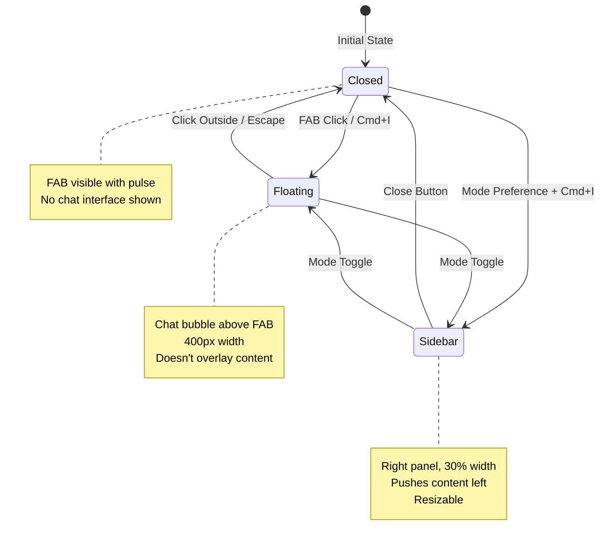
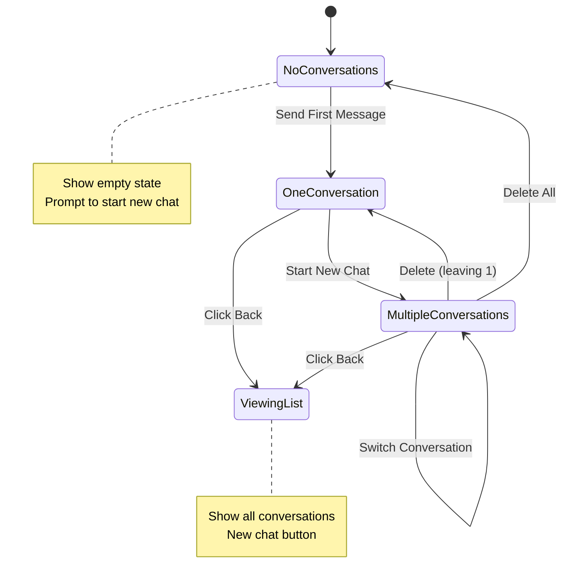
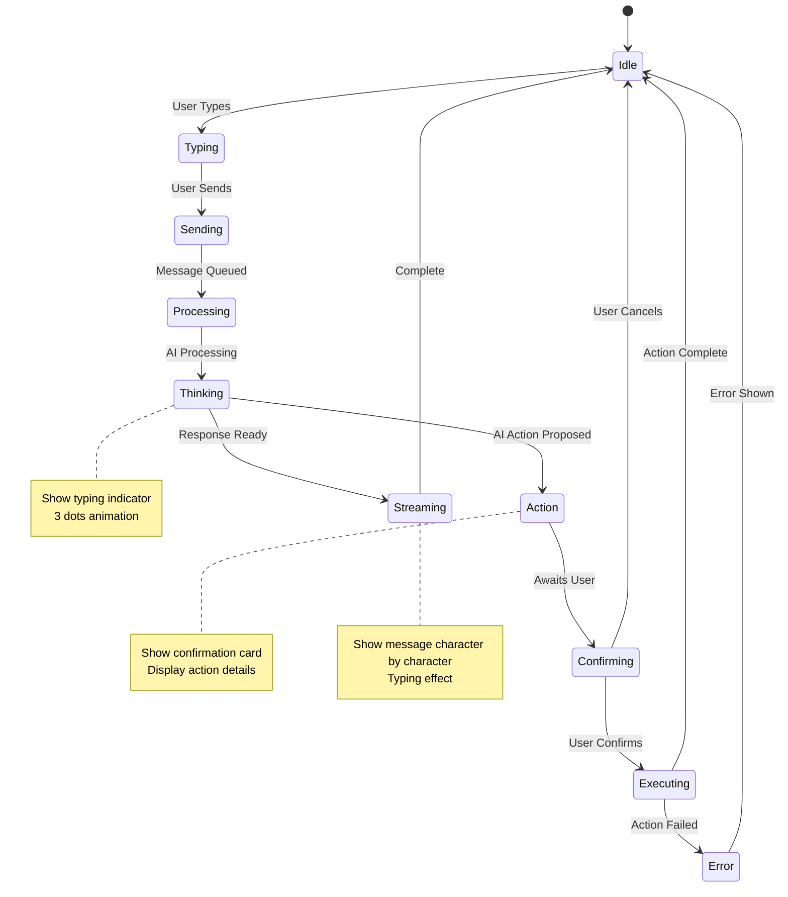
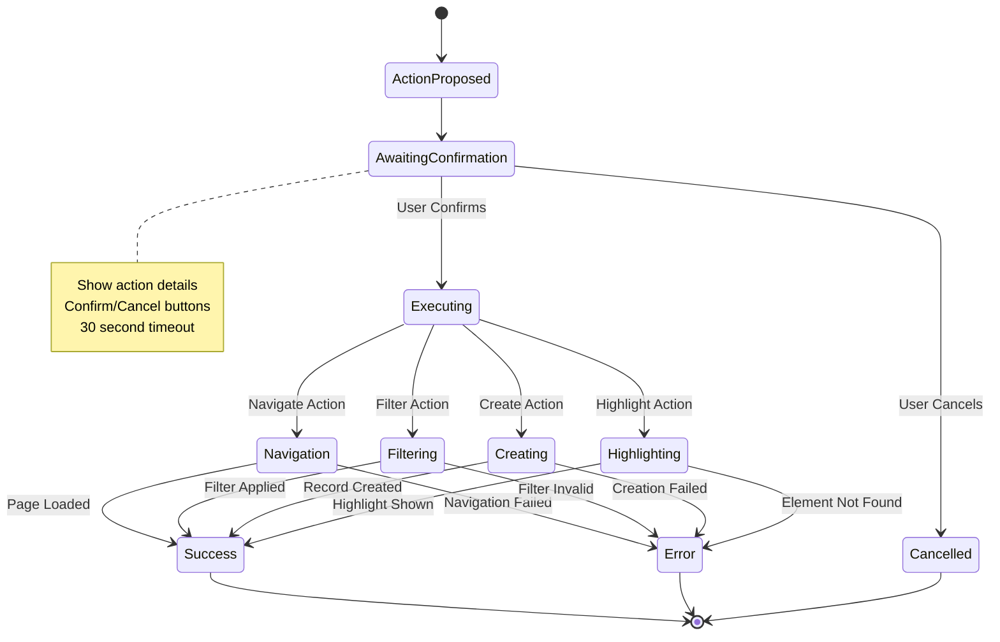
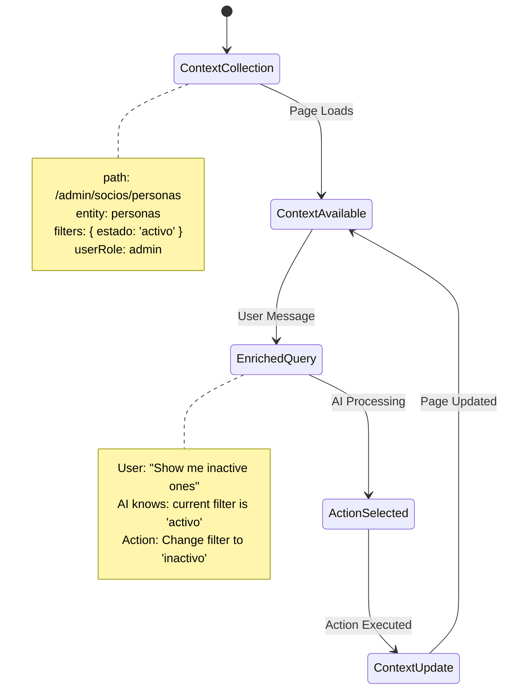
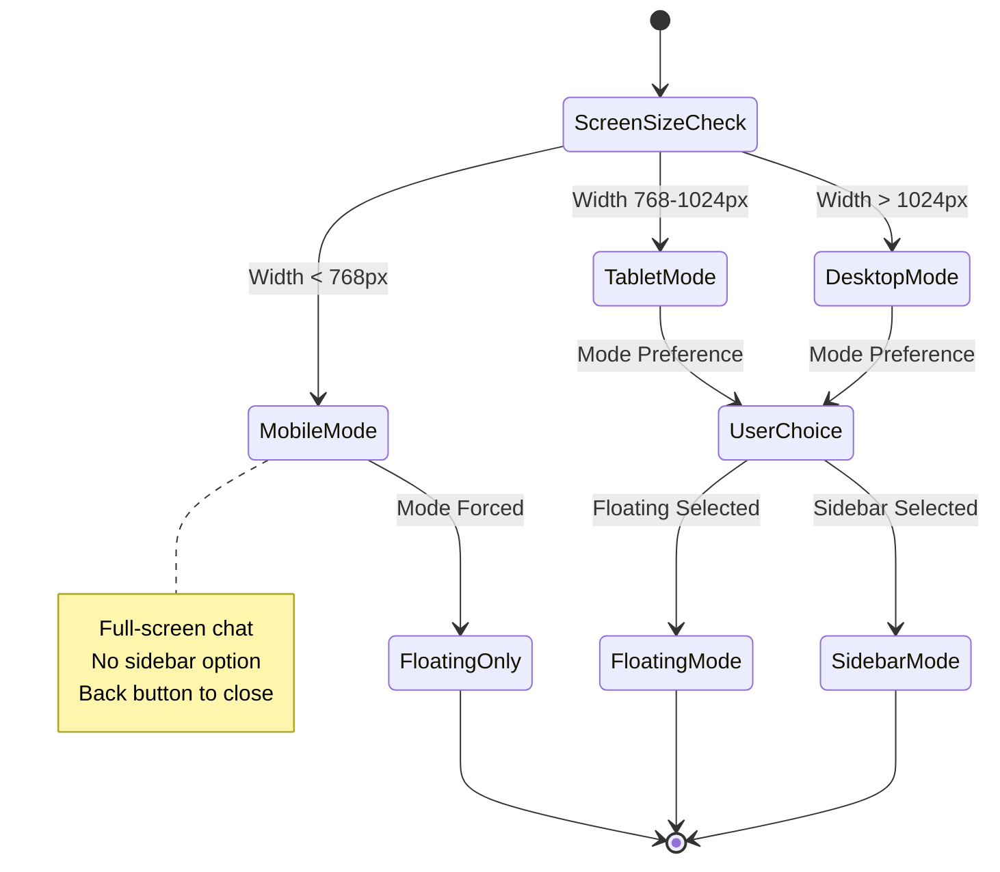

# AI Companion State Machine Diagrams

## Mode Toggle State Machine

## Conversation State Machine

## Message Flow State Machine

## Action Execution State Machine

## Page Context Flow

## Mobile Responsiveness State Machine

