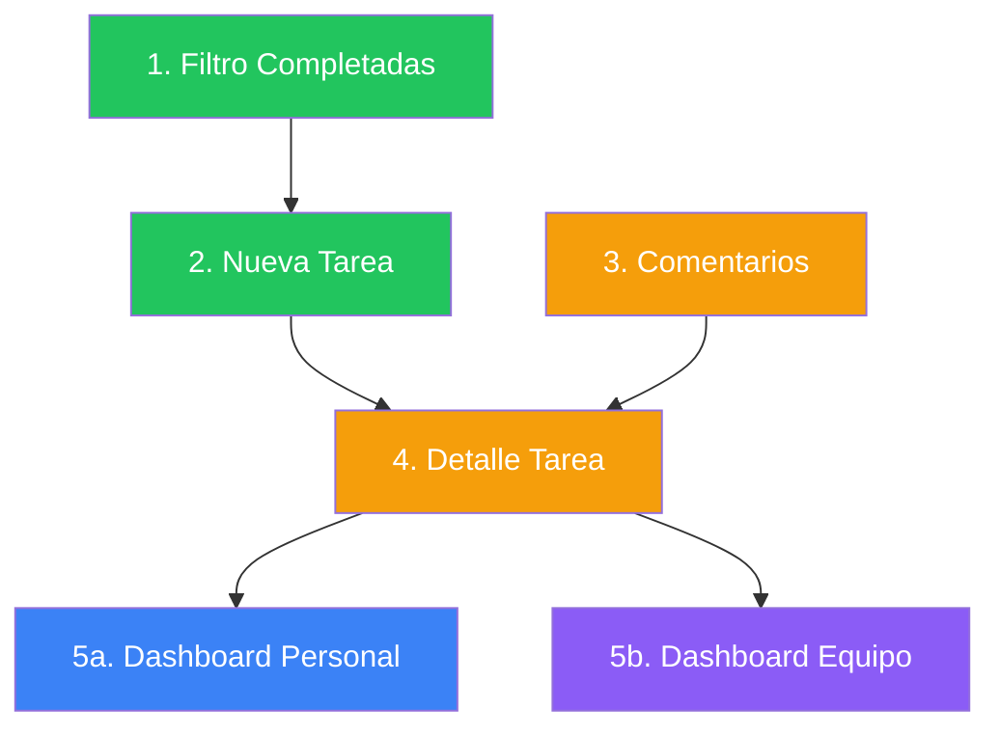

# PRDs de Funcionalidades de Tareas

## Índice de Documentos

| # | PRD | Archivo | Tiempo Est. |
|---|-----|---------|-------------|
| 1 | Filtro de Tareas Completadas Antiguas | [01-filtro-tareas-completadas.md](./01-filtro-tareas-completadas.md) | 2-3 horas |
| 2 | Nueva Tarea (Drawer) | [02-nueva-tarea-drawer.md](./02-nueva-tarea-drawer.md) | 4-5 horas |
| 3 | Sistema de Comentarios | [03-sistema-comentarios.md](./03-sistema-comentarios.md) | 4-5 horas |
| 4 | Vista de Detalle (Drawer) | [04-detalle-tarea-drawer.md](./04-detalle-tarea-drawer.md) | 4-5 horas |
| 5a | Dashboard Personal ("Mis Tareas") | [05a-dashboard-personal.md](./05a-dashboard-personal.md) | 8-9 horas |
| 5b | Dashboard de Equipo (Admin) | [05b-dashboard-equipo.md](./05b-dashboard-equipo.md) | 10-11 horas |

**Tiempo Total Estimado**: ~33-38 horas

---

## Dashboards: Personal vs Equipo

| Aspecto | Dashboard Personal | Dashboard de Equipo |
|---------|-------------------|---------------------|
| **Ubicación** | `/admin/mis-tareas` | `/admin/procesos/tareas/dashboard` |
| **Datos** | Solo tareas del usuario | Todas las tareas |
| **Acceso** | Todos | Solo admin/owner |
| **Propósito** | Autogestión | Supervisión |
| **Componentes clave** | Mi Foco Hoy, Racha | Alertas, Redistribución |

---

## Orden de Implementación Recomendado

### Fase 1: Funcionalidad Básica (Paralelo)

Estos se pueden hacer **en paralelo**:

| PRD | Dependencias | Por qué primero |
|-----|--------------|-----------------|
| **#1 Filtro Completadas** | Ninguna | Mejora UX inmediata, bajo esfuerzo |
| **#2 Nueva Tarea** | Ninguna | Funcionalidad crítica ausente |
| **#3 Comentarios** | Ninguna | Requiere migración DB |

### Fase 2: Funcionalidad de Detalle

| PRD | Dependencias |
|-----|--------------|
| **#4 Detalle Tarea** | #3 (Comentarios) |

### Fase 3: Dashboards (Paralelo)

Estos se pueden hacer **en paralelo** una vez completada la Fase 2:

| PRD | Dependencias | Notas |
|-----|--------------|-------|
| **#5a Dashboard Personal** | #1-4 recomendado | Podría ser homepage post-login |
| **#5b Dashboard Equipo** | #1-4 recomendado | Solo para admin/owner |

---

## Matriz de Dependencias

| PRD | Depende de | Bloquea a |
|-----|------------|-----------|
| #1 Filtro | - | - |
| #2 Nueva Tarea | - | - |
| #3 Comentarios | - | #4 |
| #4 Detalle | #3 | - |
| #5a Dashboard Personal | - (mejor con #1-4) | - |
| #5b Dashboard Equipo | - (mejor con #1-4) | - |

---

## Sugerencia de Sprints

### Sprint 1 (1-2 días) - Funcionalidad Básica
- ✅ #1 Filtro de Completadas (2-3 horas)
- ✅ #2 Nueva Tarea - versión base (2 horas)
- ✅ #3 Comentarios - migración DB via MCP (30 min)

### Sprint 2 (2-3 días) - Integración
- ✅ #2 Nueva Tarea - comboboxes (2-3 horas)
- ✅ #3 Comentarios - server actions y UI (3-4 horas)
- ✅ #4 Detalle - versión base (3 horas)

### Sprint 3 (2-3 días) - Dashboard Personal
- ✅ #5a Dashboard Personal - todos los componentes (8-9 horas)

### Sprint 4 (3-4 días) - Dashboard Equipo
- ✅ #5b Dashboard Equipo - todos los componentes (10-11 horas)

---

## Notas de Implementación

### Para todas las PRDs:

1. **Base de Datos**: Usar exclusivamente **Supabase MCP Server** para migraciones
2. **Componentes**: Seguir [FORM_COMPONENTS.md](file:///Users/oscarjavier/AIProjects/Nuevo%20Stack%20CCE/Proyectos/SOCIOS_ADMIN/docs/UI/FORM_COMPONENTS.md)
3. **Patrón de Drawer**: Seguir [new-person-sheet.tsx](file:///Users/oscarjavier/AIProjects/Nuevo%20Stack%20CCE/Proyectos/SOCIOS_ADMIN/components/socios/personas/new-person-sheet.tsx)
4. **Testing**: Invalidar queries de `['tareas']` después de mutaciones

### Archivos de Referencia

- Página actual: `app/admin/procesos/tareas/tareas-page-client.tsx`
- Server Actions: `app/actions/tareas.ts`
- Columnas: `features/procesos/tareas/columns.tsx`
- Kanban: `components/procesos/tareas/tareas-board.tsx`
- Card: `components/procesos/tareas/tarea-card.tsx`

---

## Resumen Ejecutivo

| Pregunta | Respuesta |
|----------|-----------|
| **¿Se pueden hacer en paralelo?** | #1, #2, #3 sí. #4 requiere #3. #5a y #5b entre sí. |
| **¿Cuál es el más urgente?** | #1 y #2 (funcionalidad básica ausente) |
| **¿Cuál tiene más impacto?** | #5a (productividad individual) y #5b (visibilidad de equipo) |
| **¿Cuál es más complejo?** | #5b Dashboard Equipo (múltiples componentes, gráficos, permisos) |
| **¿Qué bloquea todo lo demás?** | Nada técnicamente, pero #3 debe hacerse antes de #4 |
| **¿Cuál podría ser homepage?** | #5a Dashboard Personal - ideal como landing post-login |
